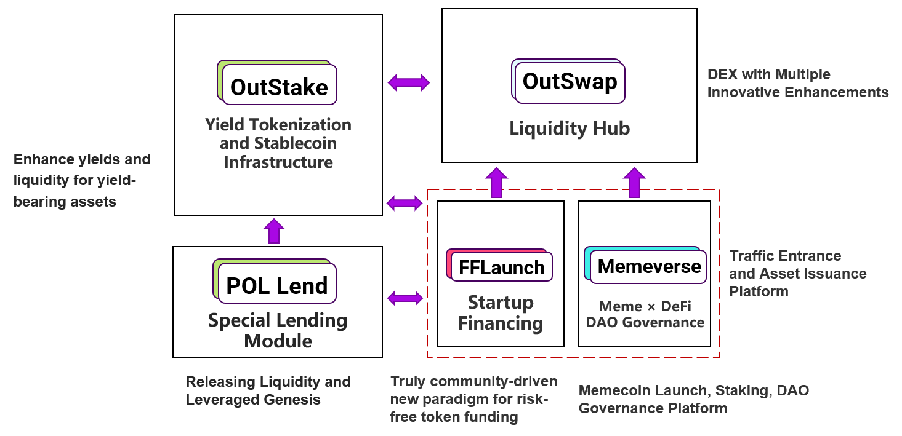

# Growth Flywheel

**Outrun** has built a unique, multi-module closed-loop ecosystem that addresses pain points in various scenarios through modular design. Each module serves a specific function, yet achieves interoperability through data and resource sharing, creating a **synergistic effect** that drives the continuous operation of the **growth flywheel**. This design significantly enhances the ecosystem's **network effects** and **capital efficiency**.


First, take a look at the **module architecture diagram** of the Outrun ecosystem:

<figure><figcaption></figcaption></figure>

* **OutStake** is the **yield tokenization and stablecoin infrastructure** of the Outrun ecosystem, serving as the foundational module. UPT Stablecoin, as the **lifeblood** of the Outrun ecosystem, flows through all modules, connecting the entire system.
* **OutSwap** is the **liquidity hub** of the Outrun ecosystem, providing efficient liquidity support for assets issued by OutStake, FFLaunch, and Memeverse, acting as the **heart** of the ecosystem.
* **FFLaunch** and **Memeverse** are the **traffic entry points** and **asset issuance platforms** of the Outrun ecosystem, located at the top layer, are the areas with the highest user activity, and serve as **powerful engines** driving the growth flywheel.
* **POL Lend** is a specialized **CDP (Collateralized Debt Position)** module, distinct from **MakerDAO**. By integrating the [**POL token**](fflaunch/proof-of-liquidity-token/) with **yield tokenization engine**, it enables users to conduct "**uncollateralized**" borrowing by **paying only interest**, thereby allowing them to autonomously "**create efficient capital out of thin air**" like a central bank, greatly enhancing the liquidity and capital efficiency of the Outrun ecosystem.

Next, we will deeply analyze how Outrun achieves synergistic effects through its unique multi-module closed-loop ecosystem.

***

### **Enhancement of OutStake by FFLaunch (Memeverse)**&#xD;

When users **participate in genesis** or **trade tokens** in the **FFLaunch** or **Memeverse** modules, the system automatically converts underlying assets (such as USDT, USDC, ETH, BNB, etc.) into corresponding UPT stablecoins (such as UUSD, UETH, UBNB, etc.) at a 1:1 exchange rate through [**Wrap Stake**](outstake/yield-tokenization/upt.md#wrap-stake).


After the genesis stage, liquidity pools deployed on **OutSwap** adopt the form of **project token (Memecoin) / UPT** trading pairs. When trading tokens with underlying assets, the system automatically compares the exchange rates of OutSwap and Wrap Stake, selecting the optimal path.


By depositing underlying assets into the OutStake module via Wrap Stake, only UPT is minted, without minting YT tokens. This means that the interest generated by the underlying assets in the integrated yield-bearing asset protocol is **distributed to other YT token holders**, thereby increasing the [**Implied Real APY**](outstake/glossary/implied-real-apy.md) of the corresponding market.

For example:

1. Assume the current APY of sUSDS is _**10%**_, with an exchange rate of sUSDS to USDC at _**1:1**_ (for simplicity, the exchange rate does not affect the final calculation), and no one has participated in staking in the sUSDS Market on OutStake, resulting in a TVL of _**0**_.
2. At this point, users in Memeverse participate in the genesis phase, depositing a total of _**1,000,000 USDC**_, which is converted into _**1,000,000 UUSD**_ through the **Wrap Stake** feature of the OutStake module.
3. Based on the [**calculation method**](outstake/glossary/implied-real-apy.md) for Implied Real APY, the current Implied Real APY for the sUSDS Market is _**3,650,000,000%**_, an undeniably attractive figure that immediately draws other users to **Stake(Not Wrap Stake)** in OutStake.
4.  We further calculate that when the **Wrap Stake TVL** is fixed at _**1,000,000 sUSDS**_, the Implied Real APY varies based on the amount of assets **Staked(Not Wrap Stake)** in the sUSDS Market, as shown in the table below:

    <table data-full-width="true"><thead><tr><th width="219.2855224609375" align="center">Stake TVL (1 Year Lock-in )</th><th align="center" valign="middle">Implied Real APY</th><th align="center" valign="top">Boost rate</th></tr></thead><tbody><tr><td align="center">0 <strong>sUSDS</strong></td><td align="center" valign="middle"><em><strong>3,650,000,000%</strong></em></td><td align="center" valign="top"><em><strong>3,650,000,00%</strong></em></td></tr><tr><td align="center"><em>1,000,000</em> <strong>sUSDS</strong></td><td align="center" valign="middle"><em><strong>20%</strong></em></td><td align="center" valign="top"><strong>100%</strong></td></tr><tr><td align="center"><em>2,000,000</em> <strong>sUSDS</strong></td><td align="center" valign="middle"><strong>15%</strong></td><td align="center" valign="top"><strong>50%</strong></td></tr><tr><td align="center"><em>3,000,000</em> <strong>sUSDS</strong></td><td align="center" valign="middle"><strong>13.33%</strong></td><td align="center" valign="top"><strong>33.33%</strong></td></tr><tr><td align="center"><em>4,000,000</em> <strong>sUSDS</strong></td><td align="center" valign="middle"><strong>12.5%</strong></td><td align="center" valign="top"><strong>25%</strong></td></tr></tbody></table>

From the table above, we can roughly predict that every **1 unit of Wrap Stake TVL** can attract an additional **3–4 units of Stake TVL**, and more TVL will lead to the minting of more **UPT** stablecoins, bringing greater liquidity to the Outrun ecosystem.


The Outrun ecosystem, through its two traffic entry points, Memeverse and FFLaunch, can naturally drive the growth of the OutStake and OutSwap modules. Therefore, our early growth focus is on the Memeverse and FFLaunch modules.

***

### **Capital Leverage of FFLaunch (Memeverse)**&#xD;

FFLaunch and Memeverse enable the Outrun ecosystem to achieve **extremely high capital efficiency**.

Example with FFLaunch

* Initial **Wrap Stake**: A user deposits **150 USDC** to participate in the FFLaunch genesis, minting **150 UUSD** through the underlying **OutStake** module.
* The genesis funds are divided into two parts:
  * **100 UUSD** is paired with **Project tokens** worth **100 UUSD** to form a trading pair, minting POL tokens worth **200 UUSD**.
  * **50 UUSD** is paired with **POL tokens** worth **50 UUSD** to form another trading pair, creating liquidity worth **100 UUSD**.
* In the end, the genesis user receives POL tokens worth **150 UUSD**, and the entire process generates a **TVL** and **ecosystem assets** worth **600 UUSD**:
  * **150 USDC** staked in the **OutStake** module.
  * Liquidity of a “**Project token / UUSD**” trading pair worth **200 UUSD** deployed in the **OutSwap** module.
  * Liquidity of a “**POL token / UUSD**” trading pair worth **100 UUSD** deployed in the **OutSwap** module.
  * POL tokens worth **150 UUSD** held by the user.
* Additional Forms of Capital Leverage:
  * As previously mentioned, **Wrap Stake** funds attract an additional **3–4 times** the OutStake TVL, while simultaneously minting **3–4 times** more UUSD.
  * As secondary market trading drives up the price of project tokens, the value of POL tokens and the liquidity deployed in the OutSwap module also increases.
  * POL tokens can be further split into PT and YT tokens.

Ultimately, the initial 150 USDC capital is amplified by more than **10 times**, efficiently utilized within the Outrun ecosystem, creating substantial additional value.

***

### **POL Lending Market: The Accelerator of Outrun’s Growth Flywheel**


[**POL lending market**](fflaunch/proof-of-liquidity-token/pol-lending-market.md) allows users to borrow UPT by paying a small amount of interest to participate in FFLaunch or Memeverse genesis activities, further amplifying the capital leverage and traffic leverage of the Outrun ecosystem.

*
  **Maximized Capital Efficiency**:
  * The POL lending market, through its low-cost leverage mechanism, lowers the entry barrier for users participating in the genesis of the Outrun ecosystem, attracting more users to engage. This not only increases liquidity but also enhances ecosystem stickiness through network effects.
  * The UPT issuance mechanism enables Outrun to directly create capital without external dependencies, akin to a central bank’s currency creation capability, but achieved in a decentralized manner.&#x20;
* **Increased UPT Adoption**:
  * UPT serves as the core store of value and medium of exchange within the Outrun ecosystem. The POL lending market significantly boosts UPT adoption, creating higher Total Value Locked (TVL). A high adoption rate of UPT strengthens the Outrun ecosystem’s resilience and market competitiveness. As more projects and users choose UPT as their preferred stablecoin, Outrun will form a value network centered around UPT.&#x20;
* **Building a Moat**:
  * Through the innovative POL token design and liquidation-free lending mechanism, the POL lending market creates a unique value proposition, making Outrun stand out in the highly competitive DeFi market. This differentiated advantage attracts more projects and users, forming a strong network effect. As the use cases and demand for UPT continue to grow, Outrun will establish a self-reinforcing ecosystem that is difficult for competitors to replicate.

***

### **OutStake's Leveraged Yield Farming**

**Traditional leveraged yield farming** essentially involves profiting from the **interest rate spread**, commonly known as "**looping loans**": users collateralize yield-bearing assets to borrow funds, purchase more yield-bearing assets, and repeat the cycle. As long as the yield from the assets exceeds the borrowing interest rate, users can continuously earn the spread, making it a typical arbitrage strategy. However, this approach carries significant risks and drawbacks:

* **Liquidation Risk**: High leverage can amplify profits, but a slight market downturn may trigger **liquidation**, potentially wiping out assets instantly, requiring careful control of leverage levels.
* **Interest Rate Volatility Risk**: The spread between borrowing rates and yield-bearing asset returns is **unpredictable,** today's **50%** leverage profit rate could plummet to **-50%** tomorrow, and adjusting positions incurs high transaction and gas fees.
* **Low Capital Efficiency**: Leveraged yields are often used to cover interest payments, resulting in low net returns.

Considering these factors, traditional leveraged yield farming struggles to sustain high returns over the long term and carries the risk of principal loss, a reality many participants have experienced firsthand.

However, Outrun effectively addresses the risks and shortcomings of traditional methods through its innovative OutStake module and UPT stablecoin, bringing revolutionary changes to leveraged yield farming:

* **Zero Liquidation Risk**: Without relying on third-party lending protocols, users can directly mint UPT stablecoins to purchase more yield-bearing assets and loop stake, completely eliminating liquidation risk.
* **No Borrowing Interest**: Users are free from paying high loan interest rates and do not need to constantly monitor interest rate spreads, ensuring consistently positive returns.
* **Maximized Capital Efficiency**: Fully unleashing the potential of funds, every cent is utilized to greater effect, with all profits belonging to the user.

Leveraged yield farming significantly enhances the TVL of the Outrun ecosystem while optimizing the supply of UPT stablecoins. Outrun dynamically balances UPT supply with the ecosystem’s economic activity needs by flexibly adjusting the UPT minting ratio and combining it with open market operations. This mechanism is akin to moderate inflation injecting vitality into an economy, ensuring maximum liquidity and user participation while maintaining the ecosystem’s stability and sustainable growth.
