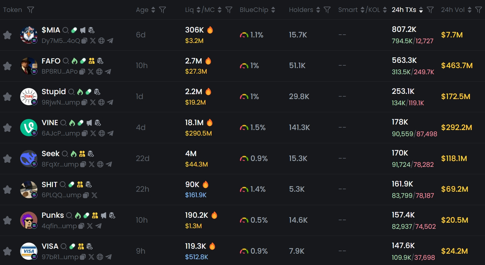

# Feasibility Study Of MemeFi(DAO)

## **Memecoin Market Dilemmas:** The Absence of Yield Tools and DAO Governance Amidst a Speculative Frenzy

The current Memecoin ecosystem faces several critical challenges (excluding risks like insider trading, Rug Pulls, or fraudulent activities, which are addressed by [**FFLaunch**](../../fflaunch/)):

1. **Single Revenue Channel**: Investors can only profit through buying low and selling high, but in volatile markets with sharp surges and crashes, most end up as "bag holders," with the majority incurring losses (CoinGecko data shows an **average 80% retracement for Top 100 Memecoins**).
2. **Liquidity Traps**: Traditional Memecoin LaunchPads burn LP tokens to lock liquidity, **permanently losing market-making income that could benefit the community**.
3. **High Market-Making Risks**: AMM liquidity providers face **impermanent loss + token devaluation risks**, with over 90% of Memecoin LP pools ending in losses (Dune on-chain data).
4. **Lack of Utility**: Memecoins are primarily speculative assets with no practical use, further exacerbated by the absence of **DAO governance tools** to unite communities and build utility.

The market urgently needs a **coin-denominated, risk-free, and sustainable profit mechanism** that allows Memecoin holders to capture ecosystem value without selling, while enabling DAO-driven community empowerment.

***

## **Outrun’s Innovation:** Recovering "Discarded Value," Zero-Impermanent-Loss Memecoin Staking Vaults, and DAO Governance.

The **Memecoin Yield Vault**, built on ERC4626, restructures value flows:

### **Core Logic**

* **Value Capture**:
  * Traditional Memecoin LaunchPads burn LP tokens → **Permanent loss of Market-making fees**.
  * Outrun directs all Memecoins into a Genesis Liquidity Pool, locking LP tokens and channeling fees into the vault → **Market-making fees become staker rewards**.
* **Risk Isolation**:
  * Users **stake Memecoins alone**, avoiding paired assets and impermanent loss.
  * Rewards sourced from trader-paid fees, **independent of token price**.
* **Anti-Selloff Design**:
  * Stakers earn token rewards daily, reducing the incentive for short-term selling.
  * Vault income scales with trading volume: **more speculation = higher staker APR**.
* **DAO Governance**:
  * Staked Memecoins mint vault tokens, which **serve as governance tokens**.
  * Participating in Memecoin community governance allows members to decide how to develop practical features for the Memecoin and **reinvest the generated income back into the community**.

***

### **Key Advantages: Why This Works**

| **Factor**                  | **Traditional Memecoin** | **Traditional AMM LP** | **Memeverse Vault**               |
| --------------------------- | ------------------------ | ---------------------- | --------------------------------- |
| **Revenue Source**          | Price appreciation       | Trading fees           | Trading fees + token appreciation |
| **Risk**                    | Rug / token volatility   | High impermanent loss  | Only token volatility             |
| **Capital Efficiency**      | 100% spot exposure       | 50% idle capital       | 100% earning yield                |
| **Sustainability**          | None                     | Requires liquidity     | Tied to volume (high turnover)    |
| **Community Value Capture** | Zero                     | Partial                | Full fee redistribution           |
| **Holder Behavior**         | Passive holding          | Active management      | Passive holding + yield           |

***

### **Revenue Logic & Data Validation**

**Revenue Source**:

* **Revenue sources**: The **Memecoin portio**n of the market-making income from the genesis liquidity pool (after protocol fees, 0.35% of the 0.7% transaction fee goes to the vault, and **the UPT portion is guided by the corresponding Memecoin DAO governance**). Since the genesis liquidity pool initially holds all of the Memecoin, the primary on-chain market-making income for Memecoin in the future will be captured by the genesis liquidity pool. (The introduction of additional income sources by the community through governance, such as developing practical applications based on Memecoin like social platforms, games, AI agents, etc., to generate more revenue, **is not discussed for now**.)
* **APR Formula: APR = Daily Turnover Rate × 0.35% × 365 ÷ Staking Rate**
  * _Daily Turnover Rate_: **Volume ÷ Market Cap**
  * _Staking Rate_: **Staked token amount ÷ Total supply**

<figure><figcaption>
The daily trading volume of Memecoin is often several times, or even hundreds of times, its market capitalization.
</figcaption></figure>

**APR Simulations**:

| **Daily Turnover** | **Staking Rate** | **APR**  |
| ------------------ | ---------------- | -------- |
| 100%               | 10%              | 1,278%   |
| 100%               | 20%              | 639%     |
| 500%               | 10%              | 6,388%   |
| 500%               | 20%              | 3,194%   |
| 1,000%             | 10%              | 12,775%  |
| 1,000%             | 20%              | 6,388%   |
| 10,000%            | 10%              | 127,750% |
| 10,000%            | 20%              | 63,875%  |

In the future, **OutSwap** will introduce a dynamic fee mechanism that **adjusts the fee rate in real-time based on on-chain transaction frequency**, thereby increasing the income to the treasury:

* When trading volume surges, the fee rate will automatically increase (e.g., from 1% to 3%), resulting in non-linear growth of revenue.
* During periods of high price volatility (usually accompanied by a spike in trading volume), it will automatically capture higher value.

***

### **Beyond Yield:** Ecological Game and Antifragile Design

**Hedging Mechanism for Sell Pressure:**

* Stakers earn token rewards daily → Reduces the incentive for "panic selling."
* High APR attracts long-term holders → Reduces volatility in circulating supply.

**Speculators Support Token Holders:**

* Higher trading volume → More fees → APR increases → Attracting more staking → Circulating supply shrinks → Token price rises, forming a positive feedback loop.

***

### **ERC4626’s On-Chain Revolution**

* **Liquid Staking**: Vault tokens integrate with DeFi (lending, liquidity pools), unlocking capital efficiency.
* **Auto-Compounding**: Yield reinvestment for compound growth.
* **Governance Expansion**: Stakers participate in Memecoin community governance, controlling the allocation of corresponding **Memeverse DAO treasury** income (**the UPT portion of market-making income**, not the Memecoin Yield Vault income), incentivizing the community to develop more practical features for Memecoin.

***

### **Industry Impact:** From speculative symbol to value carrier, and then to the shift in user mindset

The Memeverse treasury essentially transforms Memecoin into:

* **Yield-bearing asset**: Holding tokens = automatically earning ecosystem transaction taxes.
* **Governance credential**: Participating in Memecoin community governance to enhance Memecoin's practical features.
* **DeFi underlying asset**: Accessing more complex financial strategies through ERC4626 integration.

**User Mindset Shift**:

* Users no longer see Memecoin as a mere price speculation tool, but as a yield-bearing asset that appreciates on its own. Holding it generates income, completely changing the anxious mindset of "losing if it doesn’t rise."
* Users shift from "abandoning yields due to risk" to "managing risk through mechanisms." Outrun uses technical means to encapsulate and transfer impermanent loss risk to a black hole (and FFLaunch eliminates insider trading and fraud risks), allowing users to capture ecosystem profits simply by staking.
* Users evolve from "short-term speculators" to "eco-builders," participating in Memecoin community governance by holding yield-bearing staked tokens, guiding the community's values and the distribution of Memecoin DAO treasury income. The longer they hold, the higher their returns and influence, and the income generated by community governance is reinvested into the Memecoin treasury, forming a mutually beneficial ecosystem co-building community.

**Ultimate Goal**: Make Memecoin break free from the "pure gambling tool" label and transform it into a sustainable, long-term holdable value-capturing utility token.

> _"We don’t predict the future—we build it."_\
> — Outrun Core Team
