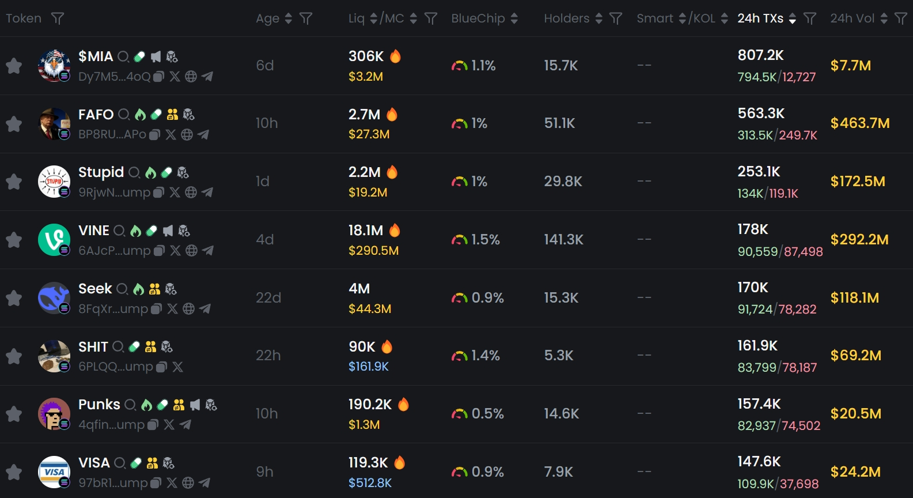

# MemeFi 可行性研究

## **Memecoin 市场困境：投机狂欢下的收益工具以及 DAO 治理缺失**

当前 Memecoin 生态呈现几大困境（不讨论内幕交易，Rug Pull，欺诈交易等风险，这在FFLaunch中得到了解决）：

1. **收益方式单一：**&#x6295;资者仅能通过低买高卖获利，但暴涨暴跌行情中多数人沦为「接盘侠」，巨幅波动下多数人成为亏损者（CoinGecko 数据显示**Top 100 Memecoin 平均回撤达 80%**）；
2. **流动性陷阱：**&#x4F20;统 Memecoin LaunchPad 为锁定流动性将 LP 代币销毁，导致**做市收入永久丢失**，社区无法利用这部分价值；
3. **做市风险极高：**&#x901A;过 AMM 流动性做市捕获收益需承受**无常损失 + 代币归零**的双重风险，**90%以上的 Memecoin 流动性池 LP 最终亏损**（Dune 链上数据）。
4. **缺乏实用性：**&#x4D;emecoin 绝大部分时候都作为一种投机资产，没有任何实用性，这也是 Memecoin 被人诟病的最大原因，而 Memecoin 社区也缺乏 DAO 治理工具使社区团结起来为 Memecoin 赋予更多实用性。

这种环境下，市场亟需一种**币本位、无风险且可持续**的收益工具，让 Memecoin 持有者无需抛售即可捕获生态价值，并且通过 **DAO 治理**的方式使社区成员为 Memecoin 赋能。

***

## **Outrun 的革新：回收「废弃价值」，零无常损失的 Memecoin 质押金库以及 DAO 治理。**

_**Memecoin 收益金库**通过 ERC4626 标准重构 Memecoin 价值流：_

### **底层逻辑**

1. **价值捕获：**
   * 传统 Memecoin LaunchPad 销毁 LP 代币 → **做市收入永久丢失**
   * 全流通的 Memecoin 全部进入创世流动性池做市以铸造 LP 代币锁定并将做市收入注入收益金库 → **做市收入转化为持币者收益**。
2. **风险隔离：**
   * 用户**仅质押 Memecoin**，无需提供配对资产，彻底规避无常损失；
   * 收益 100% 来自外部交易者支付的手续费，**与代币价格涨跌无关**。
3. **对抗抛压的博弈设计**：
   * 质押者每日赚取代币收益，减少短线抛售动机；
   * 金库收益与交易量正相关，**投机交易越频繁，持币者收益越高**。
4. **DAO治理**：
   * 通过质押 Memecoin 铸造金库质押代币，并将其作为 **Memecoin 社区治理代币**。
   * 参与 Memecoin 社区治理，可以决定如何为 Memecoin 开发实用功能，并使其产生的收入反哺社区。

***

### **核心优势：为什么这是最佳选择？**

<table data-header-hidden><thead><tr><th width="145"></th><th width="185"></th><th width="188"></th><th></th></tr></thead><tbody><tr><td>对比项</td><td>传统 Memecoin 投资</td><td>传统 AMM 做市</td><td><strong>Memeverse 收益金库</strong></td></tr><tr><td>收益来源</td><td>仅靠价格上涨</td><td>交易手续费</td><td><strong>交易手续费 + 代币增值</strong></td></tr><tr><td>风险</td><td>归零风险/接盘侠</td><td>极高无常损失</td><td><strong>仅代币价格波动，金库收益可对冲币价下跌</strong></td></tr><tr><td>资金效率</td><td>100%暴露于现货</td><td>50% 资金闲置（配对资产占用）</td><td><strong>100% 资金用于赚取收益</strong></td></tr><tr><td>收益可持续性</td><td>无</td><td>依赖持续流动性注入</td><td><strong>依赖交易量（Memecoin 天然高换手）</strong></td></tr><tr><td>社区价值捕获</td><td>零捕获</td><td>部分捕获</td><td><strong>做市及社区收入反哺持币者</strong></td></tr><tr><td>持币者行为</td><td>被动持有</td><td>主动管理，风险控制</td><td><strong>被动持有并获得利息</strong></td></tr></tbody></table>

***

### **收益逻辑与数据验证**

* **收益来源：**&#x521B;世流动性池交易手续费的 Memecoin 部分（除去协议费，0.7% 手续费中 0.35% 进入金库，**UPT 部分由对应的 Memecoin DAO 治理引导**），由于创世流动性池初始拥有全部的 Memecoin，因此未来 Memecoin 的主要链上做市收入会被创世流动性捕获（社区通过治理引入额外的收入来源暂不讨论，例如开发基于 Memecoin 的社交，游戏，AI Agent等实用程序来创造更多收入）
* **APR 计算公式：年化收益 APR = 日换手率 × 0.35% × 365 ÷ 质押率**
  * _**日换手率：**&#x6BCF;日交易量 ÷ 代币总市值_ &#x20;
  * _**质押率：**&#x91D1;库质押数量 ÷ 代币总流通量_

<figure><figcaption>
<strong>Memecoin 是一种换手率极高的代币，其每日交易额往往数倍甚至十倍，百倍于其市值</strong>
</figcaption></figure>

根据不同的换手率和质押率，经过计算我们得出以下**年化 APR** 数据：

| 日换手率   | 质押率 | APR     |
| ------ | --- | ------- |
| 100%   | 10% | 1278%   |
| 100%   | 20% | 639%    |
| 500%   | 10% | 6388%   |
| 500%   | 20% | 3194%   |
| 1000%  | 10% | 12775%  |
| 1000%  | 20% | 6388%   |
| 10000% | 10% | 127750% |
| 10000% | 20% | 63875%  |

未来 **OutSwap** 将引入动态手续费机制，**根据链上交易频率实时调控手续费率**，从而提高收益金库收入：

* 当交易量激增时，手续费率自动提升（如 1%→3%），收益非线性增长；
* 价格剧烈波动期（通常伴随交易量暴增）自动捕获更高价值

***

### **超越收益：生态博弈与反脆弱设计**

1. **抛压对冲机制**：
   * 质押者每日获得代币收益 → 减少「恐慌性抛售」动机；
   * 高 APR 吸引长期持有者 → 降低流通盘波动性。
2. **投机者供养持币者**：
   * 交易量越高 → 手续费越多 → APR 提升 → 吸引更多质押 → 流通盘收缩 → 代币价格上涨，形成**螺旋上升飞轮**。

***

### **ERC4626 的链上革命**

1. **质押凭证流通化**：
   * 质押所铸造的生息代币可接入其他 DeFi 协议（如借贷，做市等等），提高其金融属性，**释放 Memecoin 的资本效率**；
2. **收益再投资**：
   * 自动将收益复投，实&#x73B0;**「币本位利滚利」**；
3. **DAO 治理权扩展**：
   * 持币者使用质押代币投票参与 Memecoin 社区治理，**控制对应的 Memeverse DAO 金库收入（做市收入的UPT部分，非质押金库收入）分配**，激励社区为 Memecoin 开发更多实用功能。

***

### **行业影响：从投机符号到价值载体，再到用户心智转移**

Memeverse 收益金库本质上将 Memecoin 转化为：

* **生息资产**：持币=自动赚取生态交易税收。
* **治理凭证**：参与 Memecoin 社区治理，增强 Memecoin 实用功能。
* **DeFi 底层资产**：通过 ERC4626 接入更复杂的金融策略。

用户心智转移过程：

* 用户不再将 Memecoin 视为单纯的价格筹码，而是能**自我增值的生息资产**，持有即产生收益，彻底改变“不涨就亏”的焦虑心态。
* 用户从 “**因风险放弃收益**” 转向 “**用机制管理风险**”，Outrun 通过技术手段将无常损失风险封装并转移到黑洞（并且FFLaunch杜绝了内幕交易以及Rug Pull等欺诈风险），让用户通过简单的质押即可捕获生态收益。
* 用户从 “**短期投机者**” 进化为 “**生态共建者**”，通过持有生息质押代币参与 Memecoin 社区治理，引导社区价值观的走向以及 Memecoin DAO 国库收入分配，持币时间越长，收益越高，话语权越大，最后社区治理所产生的收入又反哺 Memecoin 收益金库，形成**生态共建利益共同体**。

**最终目标**：让 Memecoin 脱离「纯赌博工具」标签，成为可持续，可长期持有的价值捕获实用代币。

***

> "我们不是在预测未来，我们就是未来本身"\
> —— Outrun核心开发团队
