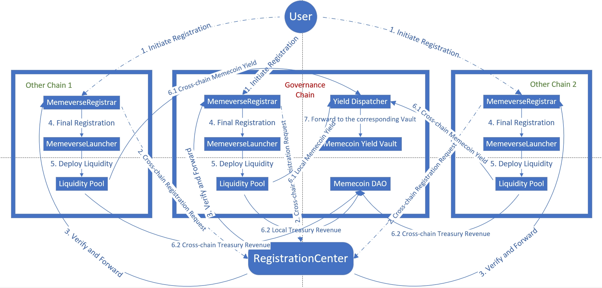

# Omnichain Interoperability

<figure><figcaption>
Simplified architecture diagram of the Memeverse
</figcaption></figure>

Memeverse is a omnichain module supported by **LayerZero**, allowing users to **register or participate in genesis** on any blockchain that has deployed this module.

To ensure that **each Memeverse's Symbol (identifier) is unique throughout its entire lifecycle (the Symbol being reusable upon the end of the lifecycle)**, the protocol has introduced a registration center to centrally manage the Symbols of omnichain Memeverse. Currently, this registration center is deployed on the **BNB Chain**.

When a user initiates a registration on any blockchain that has deployed the Memeverse module, they need to clearly specify **the governance chain and other target chains (multiple target chains can be specified)**. Subsequently, the protocol will **forward the registration request to the registration center** via cross-chain mechanisms. After receiving the request, the registration center will conduct a series of verification processes. Once all verifications pass, the registration center will initiate **cross-chain registration** operations to the user's specified target chains, **deploy token contracts** on the target chains, and collaborate with the MemeverseLauncher contract on that chain to complete the final registration process, thereby smoothly entering the **genesis stage**.

When the genesis is successful and the transition to the **liquidity lock-up stage** occurs, the corresponding **Memecoin Yield Vault** and **Memecoin DAO Treasury** will be deployed on the governance chain. All market-making revenues from the deployed genesis liquidity will be cross-chain transmitted to the **YieldDispatcher** on the governance chain. The YieldDispatcher will forward the Memecoin portion and the UPT portion of these revenues to the corresponding **Memecoin Yield Vault** and **Memecoin DAO Treasury**, respectively. It should be noted that if the corresponding **Memecoin Yield Vault** and **Memecoin DAO Treasury** do not exist on the governance chain (the governance chain genesis fails but the genesis of other target chains is successful), these market-making revenues will be directly burned.

Users can cross-chain stake their Memecoins into the **Memecoin Yield Vault** to mint **sMemecoin (Staked Memecoin)**. Holders of sMemecoin will be able to participate in the governance of the **Memecoin DAO**.
