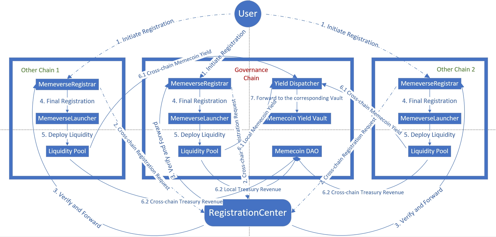

# 全链互操作

<figure><figcaption>
Memeverse 简化全链架构图
</figcaption></figure>

Memeverse 是一个由 **LayerZero** 提供支持的全链模块，允许用户在任意已部署该模块的区块链上进行注册或参与创世。

为了确保在**创世阶段期间**，**每个 Memeverse 的 Symbol（标识符）都是独一无二的（当创世阶段结束时，Symbol 可被重新注册）**，协议引入了一个注册中心来对全链 Memeverse 的 Symbol 进行集中管理。该注册中心部署在特定的单一链上。

当用户在任意已部署 Memeverse 模块的区块链上发起初始注册时，需明确指定**治理链与其他目标链（可指定多个目标链）**。随后，协议会将注册请求通过跨链机制**转发至注册中心**。注册中心收到请求后，会进行一系列验证工作。一旦所有验证均通过，注册中心便会向用户指定的目标链发起**跨链注册**操作，在目标链上**部署代币合约**，并与该链的 MemeverseLauncher 合约协同完成最终的注册流程，进而顺利进入**创世阶段**。

当创世成功并切换到**流动性锁定阶段**时，将在**治理链**上部署对应的 **Memecoin Yield Vault** 和 **Memecoin DAO Treasury**。所有已部署的创世流动性的做市收入都将跨链发送到治理链上的 **YieldDispatcher。YieldDispatcher** 会将这些收益的 Memecoin 部分以及 UPT 部分分别转发到对应的 **Memecoin Yield Vault** 和 **Memecoin DAO Treasury**。需要注意的是，如果在治理链上不存在对应的 **Memecoin Yield Vault** 和 **Memecoin DAO Treasury（当治理链创世失败但其他目标链创世成功），**&#x8FD9;些做市收入将被直接销毁。

用户可以将 Memecoin 跨链质押到 **Memecoin Yield Vault** 中，从而在治理链铸造 **stMemecoin（Staked Memecoin）**。持有 stMemecoin 的用户可以参与对应 **Memecoin DAO** 的治理。
