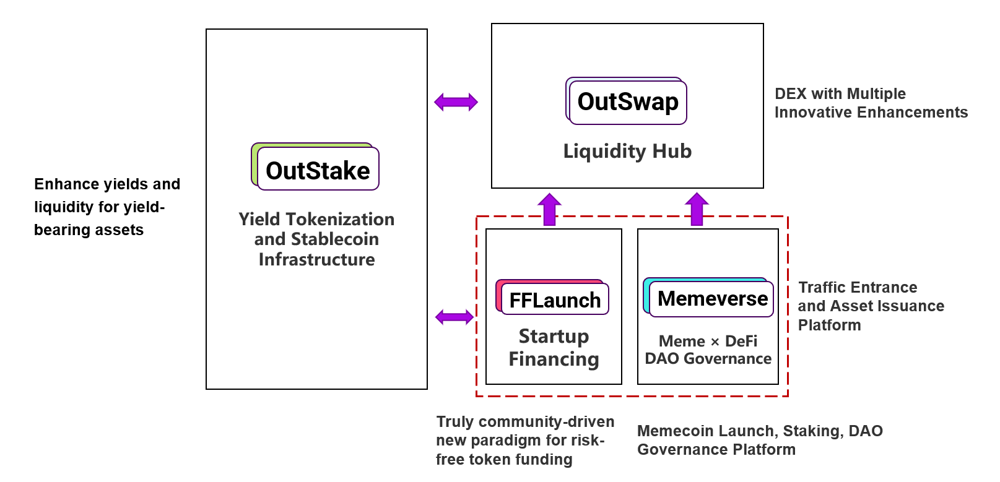

# Outrun 的协同增效与资本效率

Outrun 打造了一个独特的多模块闭环生态系统，通过模块化设计解决不同场景下的痛点。每个模块各司其职，却通过数据和资源共享实现互操作，形成**协同增效**效应，驱动**增长飞轮**的持续运转。这种设计极大增强了生态系统的**网络效应**与**资本效率**。

先看一下 Outrun 生态系统的模块架构图：

<figure><figcaption></figcaption></figure>

* OutStake 是 Outrun 生态系统的**收益率代币化**和**稳定币（**[**UPT**](outstake/yield-tokenization/upt/)**）**&#x57FA;础设施，是最底层的模块。UPT 作为 Outrun 生态系统的**血液**，贯穿所有模块，连接整个系统。
* OutSwap 是 Outrun 生态系统的**流动性枢纽**，为 OutStake、FFLaunch 和 Memeverse 发行的资产提供高效流动性支持，堪称生态系统的**心脏**。
* FFLaunch 和 Memeverse 是 Outrun 生态系统的**流量入口**与**资产发行平台**，位于生态最上层，是用户活跃度最高的区域，驱动增长飞轮的强劲**引擎**。

接下来，我们将深入剖析 Outrun 如何通过其独特的多模块闭环生态实现协同增效。

### **FFLaunch (Memeverse) 对 OutStake 的增强**

用户在 **FFLaunch** 或 **Memeverse** 模块**参与创世**或**交易代币**时，系统通过 **Simple Stake** 自动将**底层资产**（如 USDT、USDC、ETH、BNB 等）以 **1:1** 的汇率无缝转换为对应的 **UPT 稳定币**（如 UUSD、UETH、UBNB 等）。

创世结束后在 **OutSwap** 上部署的流动性池采用 _**项目代币 (Memecoin) / UPT**_ 交易对形式，而使用底层资产交易代币时，系统会自动比较 OutSwap 与 Simple Stake 的汇率，选择最优路径。

通过 Simple Stake 将底层资产存入 OutStake 模块，仅铸造 UPT 而不会铸造 YT 代币。这意味着底层资产在集成的生息资产协议中产生的利息将分配给其他 YT 代币持有者，从而提升对应市场的 [**Implied Real APY**](outstake/glossary/implied-real-apy.md)。

举个例子：

1. 假设当前 sUSDS 的 APY 为 10%，sUSDS 相对于 USDC 的汇率为 1:1（方便计算，汇率对最终计算结果无影响），并且其在 OutStake 上的 sUSDS (SKY) Market 没有任何人参与 Stake，TVL 为 0。
2. 此时 Memeverse 的用户们在 Memeverse 参与创世，一共存入了 1,000,000 USDC，这些 USDC 通过 OutStake 模块的 Simple Stake 转换成了 1,000,000 UUSD。
3. 根据 **Implied Real APY** 的算法，我们可以计算出 sUSDS (SKY) Market 当前的 Implied Real APY 为 3.65 B%，这绝对是一个吸引人的数字，立刻就会吸引有其他用户前往 OutStake 进行 Stake。
4. 我们进一步计算，当 sUSDS (SKY) Market 里通过 Stake 存入的资产价值达到 1,000,000 USD 时

&#x20;

