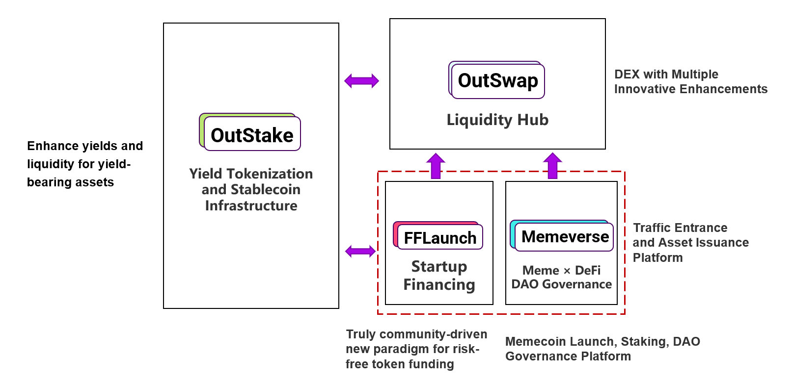

# Outrun 的增长飞轮

**Outrun** 打造了一个独特的多模块闭环生态系统，通过模块化设计解决不同场景下的痛点。每个模块各司其职，却通过数据和资源共享实现互操作，形成**协同增效**效应，驱动**增长飞轮**的持续运转。这种设计极大增强了生态系统的**网络效应**与**资本效率**。

先看一下 Outrun 生态系统的模块架构图：

<figure><figcaption></figcaption></figure>

* **OutStake** 是 Outrun 生态系统的**收益率代币化**和**稳定币** 基础设施，是最底层的模块。UPT 作为 Outrun 生态系统的**血液**，贯穿所有模块，连接整个系统。
* **OutSwap** 是 Outrun 生态系统的**流动性枢纽**，为 OutStake、FFLaunch 和 Memeverse 发行的资产提供高效流动性支持，堪称生态系统的**心脏**。
* **FFLaunch** 和 **Memeverse** 是 Outrun 生态系统的**流量入口**与**资产发行平台**，位于生态最上层，是用户活跃度最高的区域，驱动增长飞轮的强劲**引擎**。

接下来，我们将深入剖析 Outrun 如何通过其独特的多模块闭环生态实现协同增效。

***

### **FFLaunch (Memeverse) 对 OutStake 的增强**

用户在 **FFLaunch** 或 **Memeverse** 模块**参与创世**或**交易代币**时，系统通过 [**Wrap Stake**](outstake/yield-tokenization/upt/#wrap-stake) 自动将**底层资产**（如 USDT、USDC、ETH、BNB 等）以 **1:1** 的汇率无缝转换为对应的 **UPT 稳定币**（如 UUSD、UETH、UBNB 等）。

创世结束后在 **OutSwap** 上部署的流动性池采用 _**项目代币 (Memecoin) / UPT**_ 交易对形式，而使用底层资产交易代币时，系统会自动比较 OutSwap 与 Wrap Stake 的汇率，选择最优路径。

通过 Wrap Stake 将底层资产存入 OutStake 模块，仅铸造 UPT 而不会铸造 YT 代币。这意味着底层资产在集成的生息资产协议中产生的利息将**分配给其他 YT 代币持有者**，从而提升对应市场的 [**Implied Real APY**](outstake/glossary/implied-real-apy.md)。

举个例子：

1. 假设当前 sUSDS 的 APY 为 _**10%**_，sUSDS 相对于 USDC 的汇率为 _**1:1**_（方便理解，汇率对最终计算结果无影响），并且其在 OutStake 上的 sUSDS Market 没有任何人参与 Stake，TVL 为 _**0**_。
2. 此时 Memeverse 的用户们在 Memeverse 参与创世，一共存入了 _**1,000,000 USDC**_，这些 USDC 通过 OutStake 模块的 Wrap Stake 转换成了 _**1,000,000 UUSD**_。
3. 根据 Implied Real APY 的[**计算方法**](outstake/glossary/implied-real-apy.md)，我们可以计算出 sUSDS Market 当前的 Implied Real APY 为 _**3,650,000,000%**_，这绝对是一个吸引人的数字，立刻就会吸引有其他用户前往 OutStake 进行 Stake。
4.  我们进一步计算，当 **Wrap Stake TVL** 固定为 _**1,000,000**_ **sUSDS** 时，根据 sUSDS Market 里通过 **Stake** 存入的资产的数量计算出不同的 Implied Real APY，如下表所示：

    <table data-full-width="true"><thead><tr><th width="219.2855224609375" align="center">Stake TVL (1 Year Lock-in )</th><th align="center" valign="middle">Implied Real APY</th><th align="center" valign="top">Boost rate</th></tr></thead><tbody><tr><td align="center">0 <strong>sUSDS</strong></td><td align="center" valign="middle"><em><strong>3,650,000,000%</strong></em></td><td align="center" valign="top"><em><strong>3,650,000,00%</strong></em></td></tr><tr><td align="center"><em>1,000,000</em> <strong>sUSDS</strong></td><td align="center" valign="middle"><em><strong>20%</strong></em></td><td align="center" valign="top"><strong>100%</strong></td></tr><tr><td align="center"><em>2,000,000</em> <strong>sUSDS</strong></td><td align="center" valign="middle"><strong>15%</strong></td><td align="center" valign="top"><strong>50%</strong></td></tr><tr><td align="center"><em>3,000,000</em> <strong>sUSDS</strong></td><td align="center" valign="middle"><strong>13.33%</strong></td><td align="center" valign="top"><strong>33.33%</strong></td></tr><tr><td align="center"><em>4,000,000</em> <strong>sUSDS</strong></td><td align="center" valign="middle"><strong>12.5%</strong></td><td align="center" valign="top"><strong>25%</strong></td></tr></tbody></table>

从上面的表格中，我们可以大致预测，每 **1 单位 Wrap  Stake TVL** 可以吸引额外 **3 - 4 单位的 Stake TVL**，而更多的 TVL 则会铸造更多的 **UPT** 稳定币，为 Outrun 生态系统带来更多的流动性。

Outrun 生态系统通过 Memeverse 和 FFLaunch 这两个流量入口，就能够自然驱动 OutStake 与 OutSwap 模块的增长，所以早期我们的增长重点也是在 Memeverse 和 FFLaunch 这两个模块。

***

### **FFLaunch (Memeverse) 的资本杠杆**

FFLaunch 和 Memeverse 使 Outrun 生态系统具有**极高的资本效率**。

以 FFLaunch 举例

* 初始  **Wrap Stake**：用户存入 **150 USDC**，参与 FFLaunch 创世，使用底层 OutStake 模块铸造 **150 UUSD**。
* 创世资金分为两部分：
  * **100 UUSD** 与价值 **100 UUSD** 的**项目代币**组成交易对，铸造价值 **200 UUSD** 的 [**POL**](fflaunch/proof-of-liquidity-token/) 代币。
  * **50 UUSD** 与价值 **50 UUSD** 的 POL 代币组成另一个交易对，创造价值 **100 UUSD** 的流动性。
* 最后创世用户获得价值 **150 UUSD** 的 POL 代币，整个流程创造了价值 **600 UUSD** 的 **TVL** 和**生态资产**：
  * 质押在 **OutStake** 模块的 **150 USDC**。
  * 部署在 **OutSwap** 模块的价值 **200 UUSD** 的“**项目代币 / UUSD**” 交易对流动性。
  * 部署在 **OutSwap** 模块的价值 **100 UUSD** 的“**POL代币 / UUSD**” 交易对流动性。
  * 用户持有的价值 **150 UUSD** 的 POL 代币。
* 除此之外，还有几种资本杠杆
  * 前面讲过的 **Wrap Stake** 的资金吸引到的额外 3 - 4 倍的 OutStake TVL，并且同时铸造额外 3 - 4 倍的 UUSD。
  * 随着二级市场交易，项目代币价格上涨，POL 代币的价值以及部署在 OutSwap 模块上的流动性也会上涨。
  * POL 代币进一步拆分成 **PT** 和 **YT** 代币。

最终 150 USDC 初始的资本，被放大 **10** 倍以上，在 Outrun 生态系统中被高效利用，创造了大量的额外价值。

***

### **POL 借贷市场：Outrun 增长飞轮的加速器**

[**POL 借贷市场**](fflaunch/proof-of-liquidity-token/pol-lending-market.md)允许用户通过支付少量利息借入 UPT 参与 FFLaunch 或 Memeverse 的创世活动，进一步放大 Outrun 生态系统的资本杠杆与流量杠杆。

* 资本效率的极致提升：
  * 杠杆创世模块通过低成本的杠杆机制，降低了用户参与创世的门槛，吸引更多用户参与 Outrun 生态。这不仅增加了流动性，还通过网络效应增强了生态系统的粘性。
  * UPT 的发行机制使得 Outrun 能够在没有外部依赖的情况下直接创造资本，类似于中央银行的货币创造能力，但以去中心化的方式实现。
* UPT 的采用率提升：
  * UPT 是 Outrun 生态中的核心价值储存和交易媒介。杠杆创世模块能够极大得提高 UPT 的采用率，创造更高的 TVL。UPT 的高采用率将增强 Outrun 生态的抗风险能力和市场竞争力。随着更多项目和用户选择 UPT 作为创世和交易的首选资产，Outrun 将形成一个以 UPT 为核心的价值网络，
* 构建护城河：
  * 杠杆创世模块通过创新的 POL 代币设计和无清算风险的借贷机制，创造了独特的价值主张，使 Outrun 在竞争激烈的 DeFi 市场中脱颖而出。这种差异化优势将吸引更多的项目方和用户，形成强大的网络效应。随着 UPT 的使用场景和需求持续增长，Outrun 将形成一个自增强的生态系统，难以被竞争对手复制。

***

### **OutStake 的杠杆 Staking**

传统杠杆收益挖矿本质上是**利用息差获利**，俗称“**循环贷**”：用户将生息资产抵押借出资金，购买更多生息资产，循环往复。只要生息资产收益率高于借款利率，就能持续赚取差价，属于典型的套利交易。然而，这种方式存在显著风险与不足：

* **清算风险**：高杠杆可以放大收益，但市场轻微下跌可能引发**清算**，导致资产瞬间清零，杠杆水平需谨慎控制。
* **利率波动风险**：借款利率与生息资产收益率的利差**难以预测**，今天的 50% 的杠杆利率明天可能暴跌至 -50%，调整仓位还需承担高额交易费和 Gas 费。
* **资本效率低**：杠杆收益多用于支付利息，实际净收益较低。

综合上述因素，传统杠杆收益挖矿难以长期维持高收益，且存在本金损失风险，许多参与者对此深有体会。

然而 Outrun 正通过创新的 OutStake 模块与 UPT 稳定币，有效解决传统方式的风险与不足，为杠杆收益挖矿带来革命性的变革：

* **零清算风险**：无需依赖第三方借贷协议，用户可直接铸造 UPT 稳定币购买更多生息资产并循环质押，完全消除清算风险。
* **免除借贷利息**：无需支付高额贷款利息，无需实时监控息差，收益始终为正。
* **最大化资金效率**：充分释放资金潜力，每一分钱都发挥更大作用，收益全部归于用户。

杠杆收益挖矿能显著提升 Outrun 生态系统的 TVL，同时优化 UPT 稳定币的供应量。协议通过灵活调整 UPT 铸造比例并结合公开市场操作，动态平衡 UPT 的供应与生态系统的经济活跃度需求。这种机制类似于适度通货膨胀为经济注入活力，确保资金流动性和用户参与度最大化，同时维持生态系统的稳定性和可持续增长。
