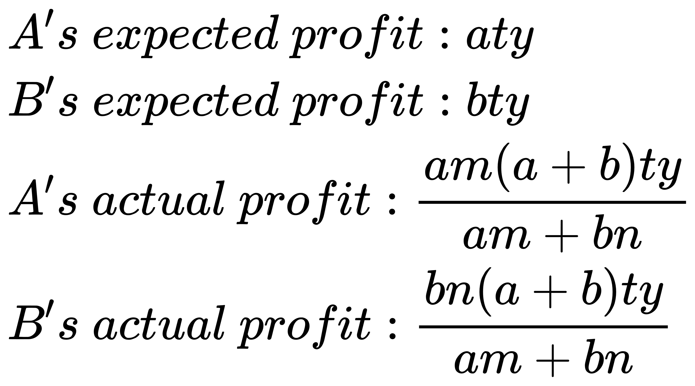
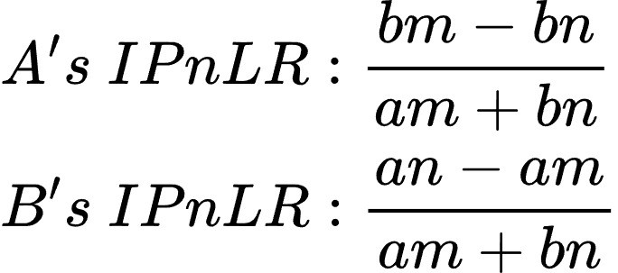
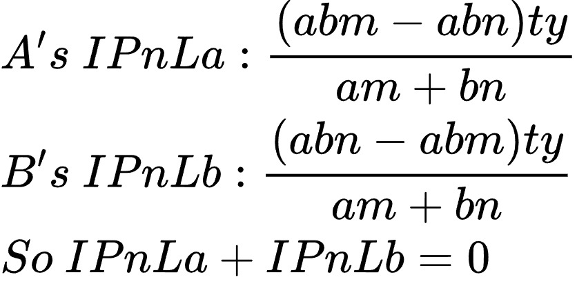

# Mathematical model

While **YT** may appear simple on the surface, the ability for **YT** to be freely traded and for any **YT** holder to redeem native yields at any time introduces a highly complex game-theoretic process and mathematical model.

The following, we construct a **minimal model** to calculate impermanent profit and losses.

Assuming that the accumulated native yield in the YieldPool is 0, and 1 YT is pegged to the yield produced by 1 native yield token over 1 day, which we denote as y.&#x20;

User A stakes **𝑎** native yield tokens and locks them for **𝑚** days, which will mint **𝑎𝑚** YTs. We will consider other users as a collective entity, referred to as User B, who stakes **𝑏** native yield tokens and locks them for **𝑛** days, which will mint **𝑏𝑛** YTs.

After **𝑡** days:

<figure><figcaption></figcaption></figure>

The **Impermanent Profit and Loss Ratio (**_**IPnLR**_**)** can be obtained by dividing the actual earnings by the expected earnings and then subtracting 1.\
_**IPnLR = (Actual Earnings / Expected Earnings) - 1**_

<figure><figcaption></figcaption></figure>

The **impermanent profit and loss** **(**_**IPnL**_**)** can be obtained by multiplying each user's **impermanent profit and loss ratio** **(**_**IPnLR**_**)** by their respective expected earnings.\
_**IPnLa = IPnLRa \* Expected Profit\_A**_\
_**IPnLb = IPnLRb \* Expected Profit\_B**_

<figure><figcaption></figcaption></figure>

From the above figure, we can deduce that there is an impermanent profit and loss conservation between User _A_ and User _B_. If User _A_ and User _B_ lock up their assets for the same duration, both parties would experience no impermanent profit or loss. In other words, an individual user's impermanent profit and loss are correlated with the weighted average duration of other users in the staking pool.

Of course, the above is just a minimal model. The actual situation will be more complex due to the influence of multiple players in the game. Therefore, we will set a maximum lock-up time limit -- _**MaxLockInterval**_. The closer the user's lock-up time is to _**MaxLockInterval**_, the smaller the _**IL**_ and the larger the _**IP**_. Additionally, users can reduce _**IL**_ and obtain more _**IP**_ by redeeming their principal immediately upon the expiration of the lock-up period and then staking to mint REY again. When the user's lock-up time is _**MaxLockInterval**_, there will definitely be no _**IL**_.

Based on the model presented above, Outrun can help long-term stakers earn more income. We believe that ETH staking itself aims to make Ethereum more decentralized and secure. Therefore, users who contribute to the long-term protection of Ethereum should be rewarded more generously.
