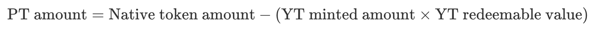

# Principal Token (PT)

**PT** is obtained by staking **Non-Rebase native yield tokens** and specifying a lock-up period.

For **Non-Rebase native yield tokens**, the quantity of **PT** is not minted on a 1:1 basis with the staked **Non-Rebase native yield tokens** but is related to the staking duration (number of **YT** minted) and the redemption ratio of the **Non-Rebase native yield token** relative to the native token. In simple terms, first convert the amount of **Non-Rebase native yield tokens** to the corresponding amount of native tokens, and then use the following algorithm to calculate:

<figure><figcaption></figcaption></figure>

**YT Redeemable Value:** The native yield that can be redeemed by burning one **YT**.

It is important to note that while the quantity of **Non-Rebase native yield tokens** staked does not change upon maturity, their value (relative to the redemption ratio of native tokens) increases with the accumulation of native yield. Therefore, burning **PT** will not redeem the same amount of **Non-Rebase native yield tokens** as initially staked but will be slightly reduced, as part of the value is attributed to **YT**.
