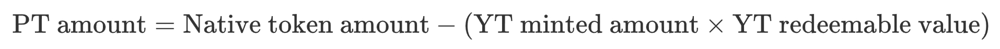

# PT

PT is a staked principal token minted by staking SY, designed to unlock the liquidity of staked tokens. When users stake SY, they must specify a lock-up period to mint PT, YT. The amount of PT is not minted on a 1:1 basis with the staked SY but is instead related to the staking duration (the amount of YT minted) and the **exchange rate** of the Yield-bearing Token to the Underlying Asset Token. Simply put, the amount of the Yield-bearing Token is first converted to the equivalent value of the Underlying Asset Token, and then the following algorithm is applied to calculate it:

<figure><figcaption></figcaption></figure>

**YT Redeemable Value:** The yields that can be redeemed by burning one **YT**.

Therefore, the value of PT is theoretically pegged to the value of the underlying asset token. IIts total supply will always be less than the quantity of underlying asset tokens that the staked yield-bearing tokens can be exchanged for, ensuring that the value of PT does not become decoupled from the value of the underlying asset token.

Over time, as the yield pool continuously accumulates yields, the redeemable value of YT increases. The amount of PT minted from newly staked SY will slightly decrease, but regardless of the number of PT minted, users will be able to burn the PT minted at that time to fully redeem their staked SY upon the lock-up period's expiration.

In general, Yield-bearing Tokens can be roughly classified as follows:

1. Rebase Tokens - Tokens that increase their balance over time.

_Examples: stETH, aUSDC_

2. Reward-bearing Non-Rebase Tokens - Tokens that appreciate in value over time.

_Examples: wstETH, Stone, slisBNB_

**It is important to note**: For reward-bearing non-rebase Yield-bearing Tokens, the quantity of staked Yield-bearing Tokens in the position does not change after the lock-up period expires. However, their value (relative to the Underlying Asset Token's exchange ratio) will increase with the accumulation of yields. Thus, burning PT does not redeem the same quantity of non-rebase Yield-bearing Tokens as initially staked; instead, it will be slightly less because part of the value is attributed to YT.

### **Universal Asset Principal Token**

OutStake’s UPT is an omnichain universal principal token. Unlike a unique PT corresponding to each specific interest-bearing token, UPT is supported by multiple interest-bearing tokens backed by the same underlying asset. When staking and locking a position, users can choose to mint either UPT or a standard PT. For example, staking Stone, wstETH, or BETH allows users to opt for minting UETH. This enables liquidity to be shared among different interest-bearing tokens with the same underlying asset, thereby enhancing the liquidity of similar interest-bearing tokens and improving their composability and network effects.

For example, with ETH, there are currently many LSTs (Liquid Staking Tokens) related to ETH in the market. The liquidity of these tokens is fragmented, with some having ample liquidity and others having less. The liquidity of an LST is often related to its adoption in DeFi programs, such as the depth of liquidity pools like LST/ETH or LST/USDT.&#x20;

The liquidity accumulation process for each LST can be challenging. Introducing UPT can reduce these redundant processes. Suppose there is a liquidity-scarce LST called xETH. The market would only need liquidity pools such as UETH/ETH and UETH/USDT. By staking xETH through OutStake to mint UETH, it can connect to the existing liquidity in the market. As more market-validated LSTs are added, liquidity will become increasingly ample.

It’s worth noting that not all interest-bearing assets backed by the same underlying asset can be used to mint UPT. This requires a series of rigorous evaluations, including aspects such as security, stability, and the degree of decentralization.

### Omnichain Standard

UPT is built using LayerZero’s Omnichain Fungible Token (OFT) standard, making it an omnichain token that can seamlessly transfer to any blockchain, amplifying its network effects. This is highly significant for its integration and interoperability with other modules in the Outrun ecosystem.
