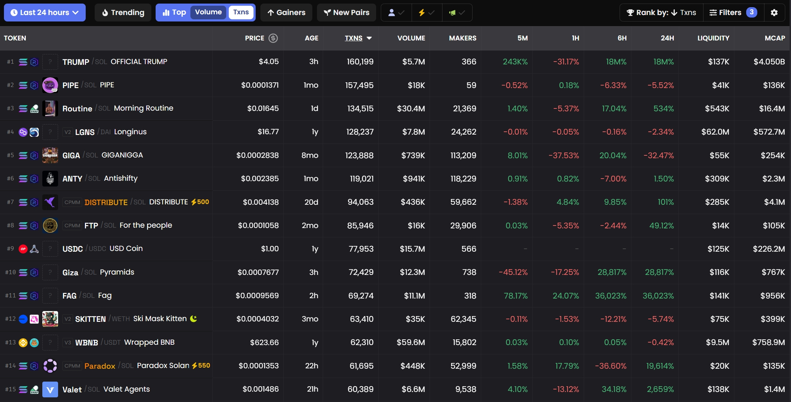

# Working Principle

**MEV Guard** is a **fully on-chain, standalone native module** that is highly concise and does not require the introduction of external off-chain systems, nor is it a token issuance mechanism like LBP (Liquidity Bootstrapping Pool). It provides protection across different lifecycle stages of a liquidity pool, effectively mitigating the impact of **initial liquidity front-running attacks** and **sandwich attacks.** Next, we will explain in detail how **MEV Guard** addresses these two issues separately.

***

### Addressing **Initial Liquidity Front-Running Attack**

The core feature of an initial liquidity front-running attack is the **one-time purchase of a large quantity of tokens within the same block as the initial liquidity deployment**, thereby monopolizing the initial token supply. To counter this key characteristic, MEV Guard’s solution **provides protection for a specific range of blocks following the deployment of the initial liquidity pool**. The details are as follows:

1. **Protection Period Configuration**: Based on the block times of different chains, an initial liquidity protection period is established, lasting for a variable number of blocks, **typically extending over hundreds of blocks**.
2. **Randomness Check**: Introduce a randomness check to **dynamically adjust** the probability based on the number of transactions attempted in the previous block. Transactions that fail the check will be interrupted rather than reverted, ensuring all transactions have an equal opportunity for execution.
3. **Transaction Count Restriction**: Within each block, the current liquidity pool can only process one **executable transaction**, with any subsequent transactions being **interrupted** to reduce the impact of Sybil attacks.
4. **Transaction Size Limitation**: The maximum token amount per transaction must not exceed one percent of the total reserves in the liquidity pool, preventing monopolization of the token supply.
5. **Protection Period Termination**: Upon the conclusion of the initial liquidity protection period, all the aforementioned restrictions are automatically removed.


**Interruption Mechanism**: To track the number of attempted transactions (including failed ones) in each block, a failed transaction will not revert but will instead be interrupted, restoring the state to that of the previous swap state (in the case of multi-hop swaps).


Through the above measures, MEV front-running attacks can be effectively prevented. No one can predict in advance whether their transaction will be executable, as all transactions during the initial liquidity protection period are subject to uncertainty, and transaction sizes are restricted to prevent monopolization of the token supply.

***

### Addressing **Sandwich Attack**

The core characteristic of a sandwich attack is that **the attacker inserts their own transactions before and after a target transaction within the same block**, involving both front-running and back-running. In other words, a single sandwich attack **involves at least three transactions**. To address this key feature, MEV Guard’s solution introduces an Anti-MEV switch, **allowing users to choose whether to protect their transaction from sandwich attacks**. The details are as follows:

* **Anti-MEV Switch**: When activated, it enforces that the current transaction becomes the final executable transaction for this trading pair in the current block, **reverting** all subsequent transactions for that pair within the same block. This prevents the attacker from executing the back-running transaction, directly disrupting the conditions necessary for a sandwich attack, while also making flash loans unusable for such attacks, thereby raising the attacker’s capital costs.
* **Transaction Size Check**: To prevent abuse, the protocol checks the size of Anti-MEV transactions. Only transactions with a token output exceeding a certain threshold (e.g., 0.5% of the total liquidity pool reserves, adjustable) can pass, preventing the protocol from becoming unavailable due to DDoS attacks.
* **MEV Fee**: An additional MEV fee is charged for each Anti-MEV transaction to discourage unnecessary use while simultaneously increasing the market-making profits for liquidity providers (LPs).

Through the above measures, sandwich attacks can be effectively prevented. Attackers cannot complete a sandwich attack within the same block. If they attempt to execute it across two blocks, the transparent nature of the blockchain exposes them to becoming the "prey" of other attackers. Moreover, they may even fail to complete the back-running transaction across multiple blocks, facing significant risks.

### **Does Anti-MEV Reduce Transaction Throughput?**

Anti-MEV transactions enforce that the current transaction becomes the final executable transaction for this trading pair in the current block, which might lead some to question whether this reduces transaction throughput. However, this concern is unnecessary. Next, let’s examine a set of data from [Dexscreener](https://dexscreener.com/?rankBy=txns\&order=desc\&minLiq=10000\&minMarketCap=100000\&min24HVol=10000):

We selected trading pairs from the past 24 hours that meet the following criteria: liquidity pool exceeding $10,000, trading volume exceeding $10,000, and market capitalization exceeding $100,000, as shown in the figure below.

<figure><figcaption>
Statistics of  Txns for Trading Pairs Across All Chains in the Past 24 Hours
</figcaption></figure>

According to Dexscreener data, across all trading pairs on all chains, even the trading pair with the highest number of transactions averages less than 2 transactions per second. Moreover, most active trading pairs are on chains like Solana, where block times are under 500 ms, while in mainstream EVM chains, no trading pair averages more than 1 transaction per block. Therefore, Anti-MEV transactions have virtually no impact on transaction throughput, especially considering that transactions prior to an Anti-MEV transaction remain unrestricted.
